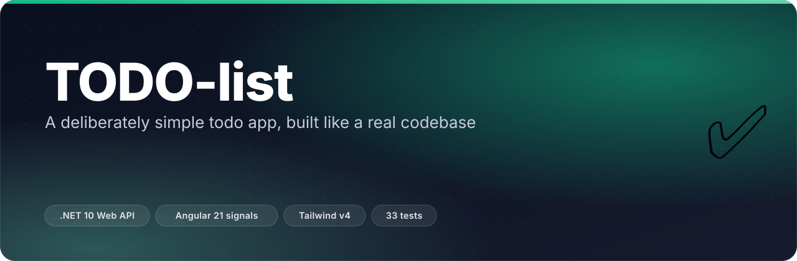
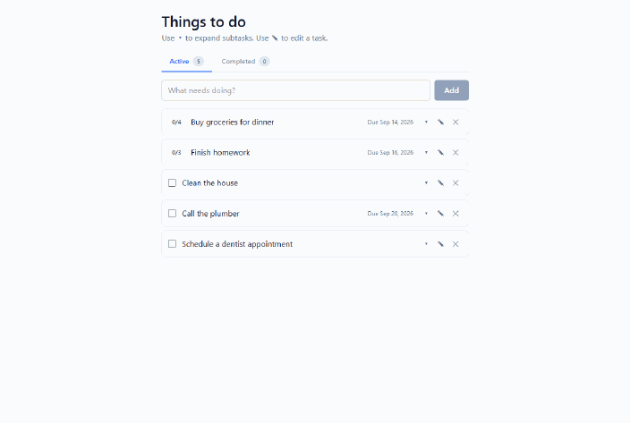
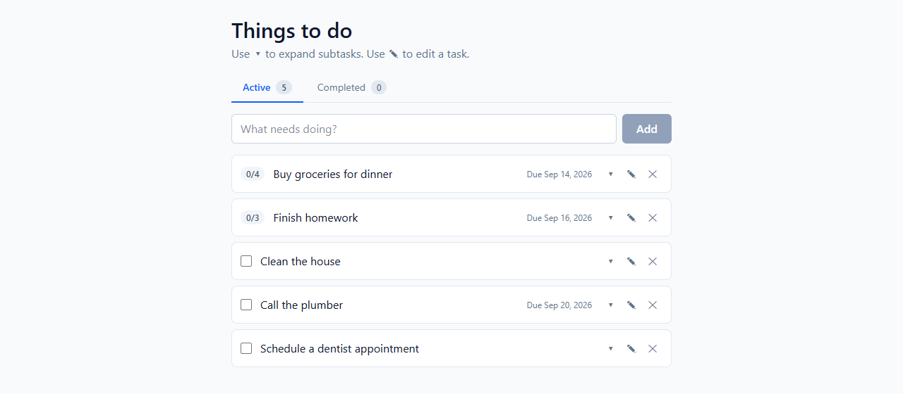
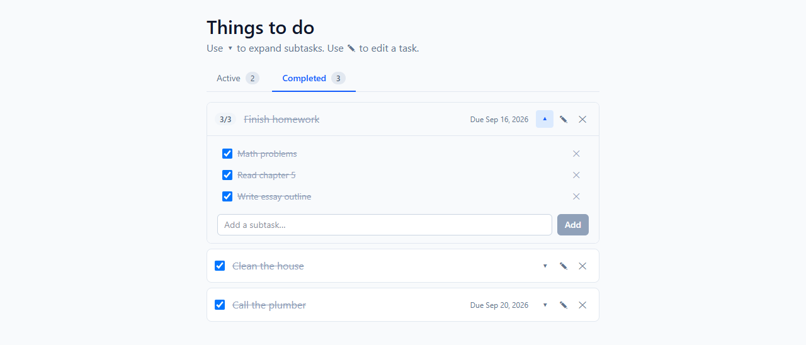
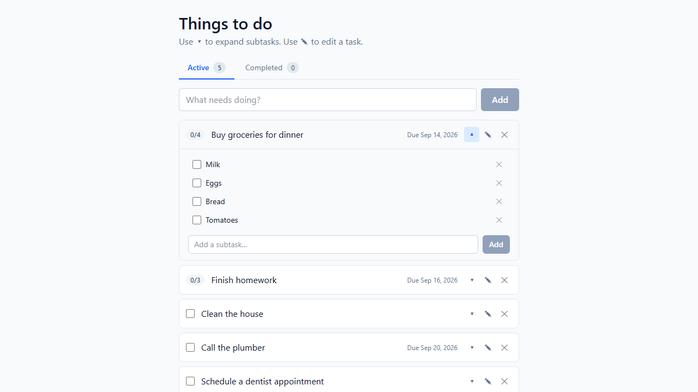
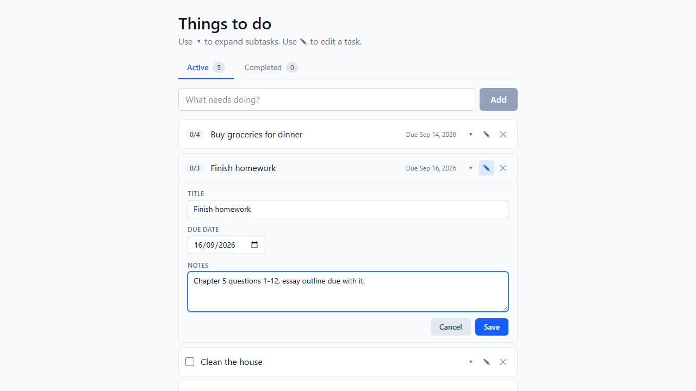
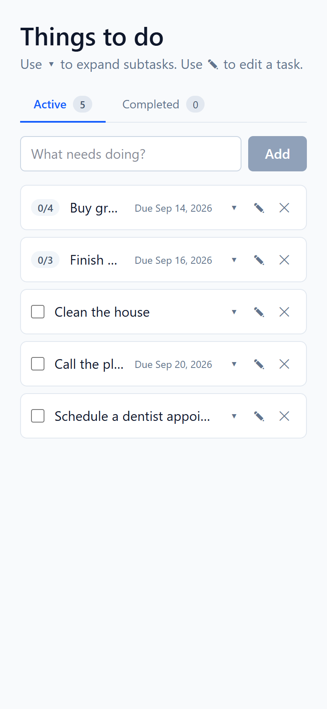
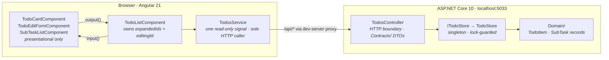
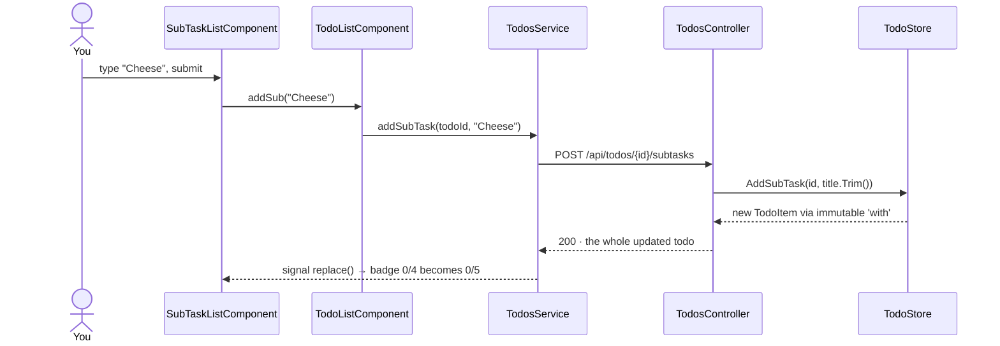

<p align="center"></p>

<p align="center">
  <b>A todo app with nothing clever in it — and every convention of a production codebase around it.</b><br>
  <sub>.NET 10 Web API · Angular 21 signals · Tailwind v4 · in-memory store, no database to install</sub>
</p>

<p align="center">
  
  
  
  
  
  
</p>

---

## ✨ What it does

- **Full CRUD on todos** — view, add, edit, delete, through eight REST endpoints.
- **Inline edit (✎)** — change title, due date and notes in the row itself; no detail page, no navigation.
- **Subtasks (▾)** — expand any todo to add, tick off or delete subtasks. The row's badge shows `done / total`.
- **Active / Completed tabs** — a todo moves to *Completed* when **every** subtask is checked, or when its top-level checkbox is ticked (for todos with no subtasks). Tab labels carry live counts.
- **Overdue dates go red** — a due date in the past is highlighted, unless the todo is already done.
- **Honest failures** — empty titles are rejected with `400`, unknown ids return `404`, and each action has its own localised error message instead of blowing away the list.
- **Nothing to install but the two runtimes.** Five todos and seven subtasks are seeded into memory at startup; state resets on restart.

---

## 🎬 See it

Every frame below is the app running locally against the real API — add a todo, add a subtask, rename it inline, tick it off, watch it land in **Completed**:

<p align="center"></p>

<table><tr>
<td width="50%"><br><sub><b>The list.</b> Seeded todos, <code>0/4</code> subtask progress badges, due dates, and per-row ▾ / ✎ / ✕ actions.</sub></td>
<td width="50%"><br><sub><b>Completed.</b> Both routes in: <i>Finish homework</i> arrived at <code>3/3</code> subtasks, the other two were ticked directly.</sub></td>
</tr><tr>
<td width="50%"><br><sub><b>Subtasks (▾).</b> Expanded in place — check, delete, or add another without leaving the list.</sub></td>
<td width="50%"><br><sub><b>Inline edit (✎).</b> Title, due date and notes, saved with one <code>PUT</code>.</sub></td>
</tr></table>

<p align="center"><br><sub>390 px viewport — the same Tailwind layout; long titles truncate rather than wrap.</sub></p>

---

## 🧠 How it works

Six moving parts, one direction of flow. **Only `TodosService` speaks HTTP, and only `TodoListComponent` injects it** — everything below the page is inputs-in, outputs-out.



There is **no ORM and no database** — `TodoStore` is a `ConcurrentDictionary<Guid, TodoItem>` behind a write lock, registered as a singleton. `ITodoStore` exists precisely so a real database implementation could replace it without the controller noticing.

Following one interaction all the way down and back:



Three decisions make that chain short:

- **Subtask mutations return the full parent todo**, not just the subtask. One round-trip gives the frontend everything it needs to redraw — no follow-up `GET`.
- **The store is the single source of truth for shape.** The controller always returns the persisted record, never the request payload, so the frontend cannot drift out of sync with what the server believes.
- **Components stay dumb.** `TodoCardComponent`, `TodoEditFormComponent` and `SubTaskListComponent` never touch HTTP or the store, which is why they are trivially testable.

<details>
<summary><b>The same walk-through in full detail — every step from click to re-render</b></summary>

### Example: adding a subtask to "Buy groceries"

```
Browser
  │
  │  1. User clicks ▾ on the "Buy groceries" row.
  │     onToggleExpand(id) flips that id in expandedIds (signal).
  │     The @if (isExpanded(id)) branch in todo-list.html mounts <app-sub-task-list>.
  │
  │  2. User types "Cheese" and submits the add-subtask form.
  │     SubTaskListComponent.onAdd() → emits addSub("Cheese").
  │     todo-list.html listener calls onAddSubTask(todoId, "Cheese").
  │     onAddSubTask → todosService.addSubTask(todoId, "Cheese").
  │
  │  3. TodosService:
  │       http.post<Todo>('/api/todos/{id}/subtasks', { title: 'Cheese' })
  │       firstValueFrom() unwraps the Observable to a Promise.
  │       On success, _todos signal is updated via replace(updatedTodo).
  │
  ▼
Angular dev server (port 4200)
  │
  │  4. proxy.conf.json forwards /api/* to http://localhost:5033.
  │     Browser sees same-origin — no CORS round-trip.
  │
  ▼
ASP.NET Core (port 5033)
  │
  │  5. Routing matches POST /api/todos/{id}/subtasks to
  │     TodosController.AddSubTask(Guid id, CreateSubTaskRequest req).
  │     The [ApiController] attribute auto-validates and binds the body.
  │     The route constraint {id:guid} rejects non-Guid ids as 404.
  │
  │  6. Controller validates non-empty title, then calls
  │     _store.AddSubTask(id, request.Title.Trim()).
  │
  │  7. TodoStore.AddSubTask takes the write-lock, looks up the parent,
  │     appends a new SubTask record (with a fresh Guid), creates a new
  │     immutable TodoItem via `with { SubTasks = newList }`, and replaces
  │     the entry in the ConcurrentDictionary atomically.
  │
  │  8. Returns the updated TodoItem. Controller wraps as 200 Ok(item).
  │
  ▼ (response)
TodosService
  │
  │  9. replace(item) is called: the signal updates so the row carrying
  │     this todo's id is swapped for the new version.
  │
  ▼
SubTaskListComponent
  │
  │ 10. Receives the new todo via its input() — Angular re-renders the
  │     subtask list, the input clears (draftTitle reset), and the row's
  │     progress badge (e.g. "0/5") increments to reflect the new subtask.
```

The same shape applies to every interaction: **click an icon button → component method → service call → HTTP → controller → store mutation → response → signal update → re-render.**

### Failure paths

- **Empty title on add/edit:** the component method short-circuits before the HTTP call; the form's "Add" button is also disabled while the draft is empty.
- **Backend down on initial load:** `ngOnInit`'s `await load()` throws, the error signal is set, and the page shows *"Could not load todos. Is the backend running?"*
- **Backend down mid-action:** the per-action `try/catch` sets a localised message ("Failed to add subtask.") but leaves the existing list intact.
- **Concurrent edits to the same todo:** the backend takes a lock for read-modify-write operations, so each request observes a consistent snapshot. Last writer wins — acceptable for an in-memory single-user app.

</details>

---

## 🚀 Quick start

You need **.NET 10 SDK** (`dotnet --version` → `10.x`) and **Node 20+ / npm 10+**. No database, no Docker, no global CLI tools. Two terminals, one per process.

```bash
git clone https://github.com/ChinmayGit8765/TODO-list.git
cd TODO-list
```

**Terminal A — the API** (listens on `http://localhost:5033`):

```bash
cd backend
dotnet restore
dotnet run
```

Wait for `Now listening on: http://localhost:5033`. HTTPS redirection is **disabled in Development**, so there is no dev certificate to trust before the app will run.

**Terminal B — the app** (opens on `http://localhost:4200`):

```bash
cd frontend
npm install        # first time only — pulls Angular, Tailwind, Vitest
npm start          # ng serve: compiles, watches, and proxies /api/* to :5033
```

Open <http://localhost:4200> and you should see five seeded todos.

<details>
<summary><b>Verifying the install without the UI</b></summary>

```bash
# Hits the backend through the Angular dev server's proxy.
curl http://localhost:4200/api/todos
```

You should get a JSON array of 5 seeded todos. `ECONNREFUSED` means the backend isn't running. **HTML** instead of JSON means the proxy isn't loading its config — check [`frontend/proxy.conf.json`](frontend/proxy.conf.json) and [`frontend/angular.json`](frontend/angular.json).

The live OpenAPI document (Development only) is at <http://localhost:5033/openapi/v1.json>. The API also carries an explicit CORS policy for `http://localhost:4200` ([`Program.cs`](backend/Program.cs)), so it works even if you bypass the proxy.

</details>

---

## 🧪 Tests

```bash
dotnet test        # from the repo root — builds both projects
cd frontend && npm test
```

| Suite | Count | What it covers |
|---|---|---|
| [`TodoStoreTests.cs`](backend.Tests/TodoStoreTests.cs) | **14** xUnit | `TodoStore` directly: seeding, add/get/update/delete, subtask lifecycle, unknown-id null handling |
| [`TodoApiTests.cs`](backend.Tests/TodoApiTests.cs) | **9** xUnit | the whole ASP.NET pipeline via `WebApplicationFactory<Program>`, hit over real HTTP with `HttpClient` |
| [`todos.service.spec.ts`](frontend/src/app/services/todos.service.spec.ts) | **8** Vitest | `TodosService` against `HttpTestingController` — asserts the signals update correctly per call |
| [`app.spec.ts`](frontend/src/app/app.spec.ts) | **2** Vitest | the `App` shell creates and renders a router outlet |

> **Stop the backend (`Ctrl+C`) before `dotnet test`.** Otherwise the build cannot replace `backend.exe` while it is running and you get a file-lock error.

---

## 🗂️ Project layout

```
TodoList.slnx                            — solution linking backend + backend.Tests
package.json                             — root: the Tailwind dependency only, no scripts

backend/                                 — .NET Web API (one deployable)
  Controllers/TodosController.cs         — HTTP boundary; the only controller
  Contracts/TodoRequests.cs              — public request DTOs
  Services/ITodoStore.cs                 — application abstraction + TodoUpdate command
  Services/TodoStore.cs                  — singleton in-memory implementation
  Domain/TodoItem.cs                     — TodoItem + SubTask records
  Domain/TodoSeed.cs                     — the 5 startup todos
  Program.cs                             — DI registration, CORS, OpenAPI, MapControllers

backend.Tests/                           — xUnit: store unit tests + endpoint integration tests

frontend/                                — Angular app
  src/app/services/todos.service.ts      — signal-based facade over HttpClient
  src/app/pages/todo-list/               — the page that composes everything (lazy-loaded)
  src/app/components/                    — todo-card · todo-edit-form · sub-task-list
  src/app/models/todo.ts                 — TS interfaces mirroring the API
  proxy.conf.json                        — dev-server proxy to :5033
  .postcssrc.json · src/styles.css       — Tailwind v4 wiring
```

---

## 🧰 Stack

| Layer | Choice | Why |
|---|---|---|
| API | **ASP.NET Core MVC** on .NET 10 | Controllers with attribute routing — the conventional enterprise layout, and `[ApiController]` gives free model binding and validation |
| Persistence | **In-memory `ConcurrentDictionary`** behind `ITodoStore` | The brief says in-memory; the interface keeps a real database a drop-in away |
| API docs | **Microsoft.AspNetCore.OpenApi** 10.0.8 | `/openapi/v1.json` in Development, driven by `[ProducesResponseType]` attributes |
| UI | **Angular 21.2** with signals, `input()` / `output()` | Modern control flow and a signal store make the read path obvious without a state library |
| State | **A signal in `TodosService`** | Three CRUD operations do not need NgRx; components re-render off one read-only signal |
| Styling | **Tailwind v4** via PostCSS | Utility classes inline in templates — no SCSS anywhere in the repo |
| Tests | **xUnit** + `WebApplicationFactory` · **Vitest** + jsdom | HTTP-level tests on the back end, `HttpTestingController` on the front |
| Dev wiring | **Angular dev-server proxy** | Forwards `/api/*` to `:5033`, so the browser never meets CORS or a self-signed cert |

<details>
<summary><b>Exact versions, and the tooling notes</b></summary>

### Backend (`backend/`)

| Thing | Version | Why |
|---|---|---|
| .NET SDK | **10.0** | Latest LTS-track |
| ASP.NET Core MVC | (bundled) | Controllers with attribute routing — conventional enterprise layout |
| Microsoft.AspNetCore.OpenApi | 10.0.8 | OpenAPI / Swagger metadata at `/openapi/v1.json` |
| C# language version | 13 (preview-aligned) | Records, file-scoped namespaces, collection expressions |

### Backend tests (`backend.Tests/`)

| Thing | Version | Why |
|---|---|---|
| xUnit | (xunit template default) | Standard .NET test framework |
| Microsoft.AspNetCore.Mvc.Testing | (bundled) | `WebApplicationFactory<Program>` for HTTP-level integration tests |

### Frontend (`frontend/`)

| Thing | Version | Why |
|---|---|---|
| Angular | **21.2** | Latest — signals, modern control flow, `input()` / `output()` APIs |
| TypeScript | 5.9 | Required by Angular 21 |
| Tailwind CSS | **4.3** | All styling done with Tailwind utility classes; no SCSS anywhere |
| PostCSS + `@tailwindcss/postcss` | 8.5 / 4.3 | How Tailwind v4 integrates with Angular's Vite-based build |
| RxJS | 7.8 | A thin layer behind `HttpClient` (`firstValueFrom`) |
| Vitest | 4.0 | Test runner (replaces Karma/Jasmine in modern Angular) |
| jsdom | 28 | DOM in the Vitest environment |
| Prettier | 3.8 | Formatter (not enforced in CI) |

### Tooling

- **Node.js** 20+ and **npm** 10+ (the repo pins `npm@11.12.0` via `packageManager`).
- **Angular Router** drives a single `/todos` route, lazy-loaded via `loadComponent`. The dev build reports a **19.4 kB initial bundle** plus a **60.7 kB** chunk for the route.
- **Angular dev-server proxy** (`frontend/proxy.conf.json`) forwards `/api/*` to the backend so the browser never deals with CORS or self-signed certs.

</details>

---

## 🔌 API reference

Base URL `http://localhost:5033/api/todos`, or `/api/todos` through the front-end proxy on `:4200`.

| Method | Path | Body | Returns |
|---|---|---|---|
| `GET` | `/api/todos` | — | `200` array of `TodoItem` |
| `GET` | `/api/todos/{id}` | — | `200` `TodoItem` · `404` |
| `POST` | `/api/todos` | `{ "title": string }` | `201` `TodoItem` (with `Location` header) · `400` |
| `PUT` | `/api/todos/{id}` | `UpdateTodoRequest` | `200` `TodoItem` · `400` · `404` |
| `DELETE` | `/api/todos/{id}` | — | `204` · `404` |
| `POST` | `/api/todos/{id}/subtasks` | `{ "title": string }` | `200` `TodoItem` · `400` · `404` |
| `PUT` | `/api/todos/{id}/subtasks/{subId}/toggle` | — | `200` `TodoItem` · `404` |
| `DELETE` | `/api/todos/{id}/subtasks/{subId}` | — | `200` `TodoItem` · `404` |

<details>
<summary><b>Payload shapes</b></summary>

```jsonc
// TodoItem
{
  "id": "9b1a0c6a-…",        // Guid, server-assigned
  "title": "Buy groceries",
  "createdAt": "2026-05-14T09:00:00Z",
  "dueAt": "2026-05-15T09:00:00Z",      // nullable
  "notes": "Don't forget bread",        // nullable
  "isComplete": false,
  "subTasks": [
    { "id": "…", "title": "Milk", "isComplete": false }
  ]
}

// UpdateTodoRequest (PUT body — all fields required)
{
  "title": "Buy groceries",
  "dueAt": "2026-05-15T00:00:00Z",      // null clears
  "notes": "…",                         // null clears
  "isComplete": false
}
```

</details>

---

## 🏛️ Architecture notes

<details>
<summary><b>Backend — single deployable, enterprise-style layering</b></summary>

- **`Controllers/`** — HTTP boundary only. Maps requests to service calls and returns `ActionResult<T>`. Every action carries `[ProducesResponseType]` attributes so the OpenAPI document lists all possible responses.
- **`Contracts/`** — public request DTOs (`CreateTodoRequest`, `UpdateTodoRequest`, `CreateSubTaskRequest`). The controller never accepts a domain entity directly, so clients cannot sneak in `Id` or `CreatedAt` through a request body.
- **`Services/`** — the application layer. `ITodoStore` is the abstraction the controller depends on; `TodoStore` is the in-memory implementation. `TodoUpdate` is the *service-layer* command record, kept distinct from the transport DTO so the store has no dependency on HTTP types.
- **`Domain/`** — pure entities: `TodoItem`, `SubTask`, plus the seed data. No framework dependencies.

The store is a **singleton** (`AddSingleton<ITodoStore, TodoStore>()`), so one instance serves the lifetime of the process. Compound read-modify-write operations (toggle subtask, update todo) take a lock to stay atomic — `ConcurrentDictionary` alone is not enough for those.

**Access modifiers.** Interfaces, DTOs and domain records are `public` because they appear in the controller's public surface. The store implementation, seed data and `TodoSeed` helpers are `internal`; `InternalsVisibleTo("backend.Tests")` opens them to the test project.

</details>

<details>
<summary><b>Frontend — one page, three presentational components</b></summary>

- **`TodosService`** (`services/todos.service.ts`) is the only place that knows about HTTP. It holds the canonical list in a read-only signal; components re-render automatically.
- **`TodoListComponent`** (`pages/todo-list/`) orchestrates per-row UI state (`expandedIds`, `editingId`) and wires service calls to events from its children.
- **`TodoCardComponent`**, **`TodoEditFormComponent`**, **`SubTaskListComponent`** (`components/`) are *dumb*: inputs in, outputs out, no service injection.
- All styling is **Tailwind v4** utility classes inline in templates. No SCSS. Tailwind is wired through PostCSS — see `.postcssrc.json`.
- The list page is **lazy-loaded** (`loadComponent`), so the initial bundle stays small.

</details>

<details>
<summary><b>Troubleshooting</b></summary>

| Symptom | Cause | Fix |
|---|---|---|
| Front-end says "Could not load todos." | Backend not running, or on a different port | Start `dotnet run` in `backend/`; confirm `http://localhost:5033/api/todos` returns JSON |
| `Port 4200 is already in use` | A previous `ng serve` is still alive | On Windows: `Get-NetTCPConnection -LocalPort 4200 -State Listen \| Select OwningProcess`, then `Stop-Process -Id <pid>` |
| `dotnet test` fails with "file is being used by another process" | The backend is still running | Stop it (`Ctrl+C`) before running tests |
| 404 on subtask `toggle` | The frontend cached an old todo id, or the parent was deleted | Reload the page so the list refetches |
| Tailwind classes have no effect | `styles.css` missing `@import "tailwindcss";`, or `.postcssrc.json` not in `frontend/` | Verify both files, then re-run `npm start` |

</details>

---

## 🗺️ Status

✅ **Complete and working** — CRUD, subtasks, inline edit, Active/Completed tabs, 23 backend tests green.
🚧 **In-memory only** — state resets on every restart. That is deliberate, not unfinished.
🔜 **Swappable persistence** — `ITodoStore` is the seam a real database would go through; nothing above it would change.

<details>
<summary><b>Things I considered and decided against</b></summary>

- **A database.** The brief says in-memory; adding one is extra surface area without solving anything the brief asks for. The store interface (`ITodoStore`) means a real database implementation could be swapped in without touching the controller.
- **LLM-assisted subtask suggestions.** I prototyped an "AI suggest" button that would POST a parent title and get back proposed subtasks. Dropped for this submission — it would need an API key, error handling for the LLM being unavailable, and setup steps in this README that would block a reviewer without a key. Happy to walk through how I'd wire it up.
- **NgRx / a state-management library.** Overkill for three CRUD operations. A signals-based service is the idiomatic Angular 17+ approach and keeps the read path obvious.
- **Splitting into actual microservices.** "Microservices" implies multiple separately deployable services with their own data stores; that is the wrong architecture for an in-memory single-entity app. The internal folder structure (Controllers / Contracts / Services / Domain) gives the same separation-of-concerns story within one service.
- **A detail page route.** An earlier version routed each todo to `/todos/:id`. Removed in favour of inline edit plus the subtask dropdown — faster interactions, fewer round-trips, less code.

</details>

---

<p align="center"><sub>Built by <a href="https://github.com/ChinmayGit8765">Chinmay</a> · part of the <a href="https://chinmaygit8765.github.io/exaryn-studio/">Exaryn</a> studio</sub></p>
